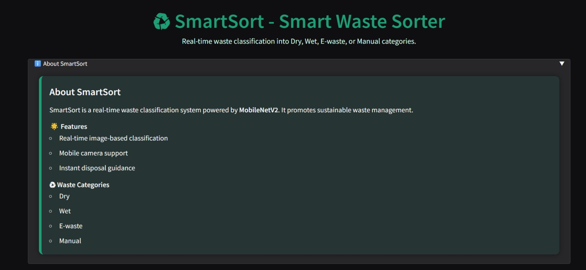
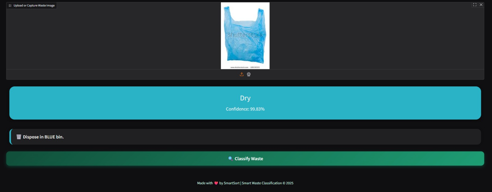

# SmartSort – Smart Waste Classification System

SmartSort is an AI-powered waste classification system that identifies waste items into four categories: **Dry, Wet, E-waste, and Manual**.

It uses a MobileNetV2 deep learning model and a custom-designed Gradio interface to provide real-time predictions and disposal guidance.

**1. Overview**

Improper waste segregation is one of the biggest challenges in sustainable waste management.

SmartSort helps solve this by providing:

* Automated waste classification
* Fast, lightweight inference using MobileNetV2
* Clean and responsive UI
* Clear disposal instructions for each category

**2. Features**

* Real-time waste classification
* Works with image upload or camera input
* Confidence-based prediction
* Color-coded result panel
* Disposal guidance based on predicted category
* CPU-friendly model

## **3. Demo Screenshots**

### SmartSort Interface

### Sample Prediction Output

**4. Project Structure**

SmartSort/

│── app.py                 # Main Gradio application

│── ecobot\_updated.keras   # Trained MobileNetV2 model

│── requirements.txt       # Dependencies

│── SmartSort.ipynb        # Jupyter notebook (Colab version)

│── README.md              # Documentation

│── .gitignore             # Ignored system files

│── LICENSE                # MIT License

│── assets/                # UI and prediction screenshots

**5. Installation \& Usage**

Step 1 — Clone the repository

git clone https://github.com/anushreerao27/SmartSort.git
cd SmartSort

Step 2 — Create a virtual environment

python -m venv venv

venv\Scripts\activate      # Windows
source venv/bin/activate   # Mac/Linux

Step 3 — Install dependencies

pip install -r requirements.txt

Step 4 — Run the application

python app.py

Access the app in your browser:

http://127.0.0.1:7860
(Note: This link only works when the app is running locally.)

**6. Waste Categories \& Disposal Guidelines**

Category	Examples	Disposal Method

Dry	Paper, cardboard, plastics	Blue Bin

Wet	Food scraps, organic waste	Green Bin

E-waste	Electronics, wires, batteries	Authorized E-waste center

Manual	Mixed or unclassifiable waste	Manual inspection

**7. Technologies Used**

* Python
* TensorFlow / Keras
* MobileNetV2
* Gradio
* NumPy
* Pillow

**8. License**

This project is licensed under the MIT License.

See the LICENSE file for details.

**9. Author**

Developed by Anushree Rao

If you found this project useful, please consider giving it a ⭐ on GitHub.

